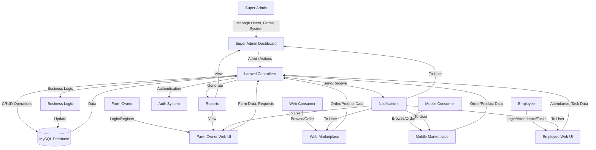

# Data Flow Diagram (DFD) - Poultry Management System (Complete)

Below is a Level 1 Data Flow Diagram (DFD) for your system, now explicitly including Super Admin, Farm Owner, Employee, and Consumer (web/mobile) roles, as well as all major modules and flows.

---

> To generate the image, copy the Mermaid code above into [Mermaid Live Editor](https://mermaid.live/) and export as PNG or SVG.
