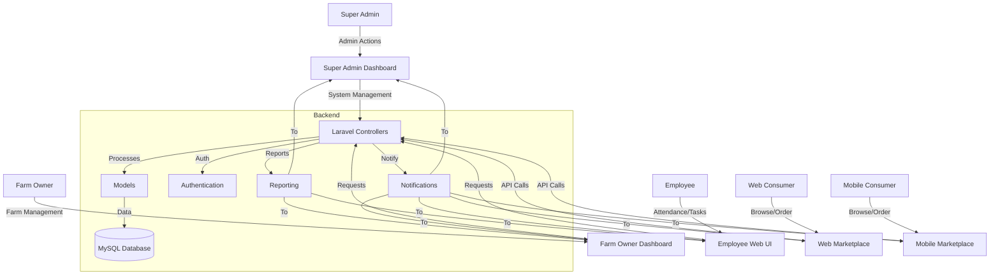

# System Architecture Flowchart (Full System, Complete)

Below is the updated architecture flowchart for your poultry management system, now explicitly including Super Admin, Farm Owner, Employee, Consumer (web/mobile), and all major modules:

---

> To generate the image, copy the Mermaid code above into [Mermaid Live Editor](https://mermaid.live/) and export as PNG or SVG.
